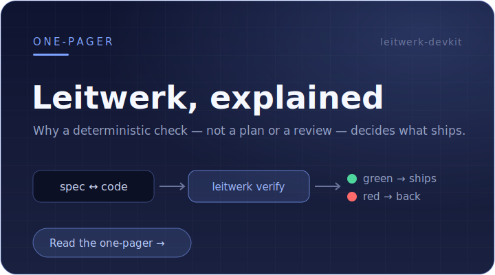
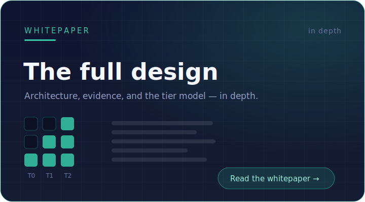

# leitwerk-devkit

**Leitwerk is a way of building software with AI agents in which a deterministic
check — not the agent's own say-so — decides what is allowed to ship.**

<table>
  <tr>
    <td width="50%" align="center" valign="top">
      <a href="https://cf-sewe.github.io/leitwerk-devkit/overview.html">
        
      </a>
    </td>
    <td width="50%" align="center" valign="top">
      <a href="https://cf-sewe.github.io/leitwerk-devkit/whitepaper.html">
        
      </a>
    </td>
  </tr>
</table>

> **Docs** ·
> [Overview (one-pager)](https://cf-sewe.github.io/leitwerk-devkit/overview.html) ·
> [Whitepaper](https://cf-sewe.github.io/leitwerk-devkit/whitepaper.html)
> — rendered via GitHub Pages; source in [`docs/`](docs/).

## What it is

AI agents generate code faster than anyone can review it, and an agent asked to
grade its own work will claim a success it cannot back up. So the accept/reject
decision has to come from outside the agent. Leitwerk puts one deterministic
command at the center — every change must pass it before it lands:

    leitwerk verify --tier <T0|T1|T2>

It returns an exit code from real tools (compiler, tests, SAST, structural
checks). Exit 0 lands; anything else is blocked — by a Claude Code hook while you
work, and by CI before merge. The agent cannot edit the gate to pass itself, and
the checks scale with blast radius (display code T0, state-mutating T1,
irreversible / infra / data T2).

Humans own intent, the spec, and the review that must be eyeballed; the agent
owns most of the code; spec and code co-evolve, and any disagreement surfaces as
drift rather than being silently resolved. **The one-pager above explains the
why; the whitepaper has the full design.**

This repository is the framework itself — and it applies Leitwerk to its own
development (the `leitwerk/`, `.claude/`, and `.github/` directories), so it
doubles as a worked reference for what an adopted repo looks like.

## Try it in 30 seconds

Run the gate against the bundled example:

```bash
mise run build                # build the gate binary (Go toolchain pinned in mise.toml)
export PATH="$PWD/core/bin:$PATH"
cd examples/reference-app
leitwerk verify --tier T0     # -> gate: PASS
```

## Using it in your project

Adoption is layered — the gate is required and tool-independent; the agent
tooling sits on top and is optional. Full phased guide: [`docs/adoption.md`](docs/adoption.md).

**1 · Make the gate available (required).** It is a single static Go binary:

```bash
# A · build from a checkout (Go toolchain pinned in mise.toml)
git clone https://github.com/cf-sewe/leitwerk-devkit && cd leitwerk-devkit
mise run build
export LEITWERK_HOME="$PWD/core"; export PATH="$LEITWERK_HOME/bin:$PATH"
# B · or install one self-contained binary (carries checks/templates via embed; needs Go):
go install github.com/cf-sewe/leitwerk-devkit/core/cmd/leitwerk@latest
# C · or download a prebuilt static binary from a release (no Go toolchain):
#     fetch leitwerk_<os>_<arch> + checksums.txt from the latest release, verify, chmod +x, put on PATH

cd /path/to/your/repo
leitwerk init      # scaffolds leitwerk/{constitution.md,tiers.conf}, CLAUDE.md, .claude/{rules,workflows}/
```

Edit `leitwerk/tiers.conf` so your irreversible paths (migrations, IaC, auth) are
T2, wire `core/checks/*` to your real toolchain, and add the CI gate
(`bindings/open/ci/leitwerk-verify.yml`) as a required check. **This alone gives
the guarantee — no agent involved.**

**2 · Claude Code plugin (optional ergonomics).**

```
/plugin marketplace add cf-sewe/leitwerk-devkit
/plugin install leitwerk@leitwerk
```

Enabling it puts `leitwerk` on the Bash `PATH` and activates two hooks
automatically — a `Stop` hook that runs the gate before a turn can end, and a
`PreToolUse` guard that blocks edits to human-owned files — plus the phase skills
and role subagents. You do not hand-edit any `.claude` hooks. The plugin's
launcher still calls the core CLI from step 1, so `LEITWERK_HOME` (or a
`go install`ed binary on PATH) must be present.

**3 · Open code (Codex, Copilot, Cursor, Aider…) — optional.** Copy
`bindings/open/AGENTS.md` to your repo root and edit the project-specific parts;
add `.codex/` if you use Codex. There is no universal hook, so the CI gate from
step 1 is what enforces the bar.

### What ships where

| Piece | Delivered by | Auto-active in a session? |
|---|---|---|
| The gate (`leitwerk verify`) | core CLI (`mise run build` / `go install` / `LEITWERK_HOME`) | it *is* the guarantee |
| Governance: constitution, `tiers.conf` | `leitwerk init` | — (human-owned) |
| `CLAUDE.md`, `.claude/rules/` | `leitwerk init` | yes — Claude reads them |
| Phase skills, role agents | Claude plugin | on enable |
| Stop-hook gate + PreToolUse guard | Claude plugin (`hooks.json`) | **yes — no manual setup** |
| Review workflow (`.mjs`) | `leitwerk init` → `.claude/workflows/` | opt-in (ultracode) |
| CI gate, `AGENTS.md`, Codex agents | `bindings/open/*` (copy) | CI: yes |

## Repository layout

```
core/        TOOL-AGNOSTIC gate: the Go CLI (bin/leitwerk), one script per check,
             the default tier policy, and init templates. Runs with only a shell.
bindings/    thin per-tool adapters that INVOKE core, never reimplement it —
             claude/ (plugin: skills, roles, hooks) and open/ (AGENTS.md + CI).
examples/    a reference app already onboarded — run the gate and watch it pass.
docs/        whitepaper, overview, adoption guide, and the design/research record.

# the devkit governing itself (dogfooding — not shipped to adopters):
leitwerk/    this repo's own constitution, tiers, specs, roadmap, and repo-local checks.
.claude/ .github/   this repo's Claude config and CI — the gate gating its own development.
```

The layout mirrors the architecture: a tool-agnostic **core** plus **thin
bindings** that only invoke it — which is what lets the same guarantee hold
across Claude Code, Codex, and CI.

## Status

v0.1 scaffold. The gate is a compiled, unit-tested Go binary and the tier logic
works; most `core/checks/*` are auto-detecting stubs that skip cleanly until
wired to a project's real toolchain. See the
[whitepaper](https://cf-sewe.github.io/leitwerk-devkit/whitepaper.html) and the
design record in [`docs/`](docs/) for the rationale.
